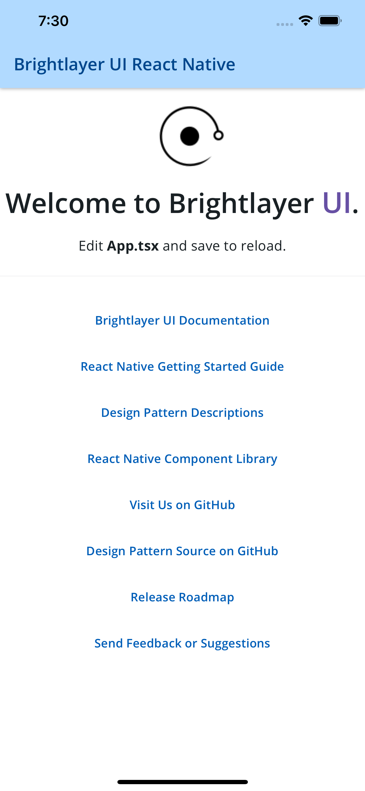

# React Native CLI Templates

These are project templates that are used by the PX Blue CLI when starting a new PX Blue project. They are used behind the scenes by the PX Blue CLI.

## Available Templates

### Blank
The Blank template provides a bare-bones application with PX Blue components and themes automatically configured and ready to use. This template is available in [TypeScript](https://www.npmjs.com/package/@pxblue/react-native-template-blank-typescript)(recommended) and [JavaScript](https://www.npmjs.com/package/@pxblue/react-native-template-blank).

### Routing
The Routing template provides all of the essential PX Blue configuration as well as additional configuration for using [React Navigation](https://reactnavigation.org/). It also adds a navigation Drawer to switch between several sample screens. This template is available in [TypeScript](https://www.npmjs.com/package/@pxblue/react-native-template-routing-typescript)(recommended) and [JavaScript](https://www.npmjs.com/package/@pxblue/react-native-template-routing).

|                | placeholder landing page | navigation drawer & routing  | login & registration screens  |
| -------------- | -- | -- | -- |
| Blank          | ✅ |    |    |
| Blank          | ✅ | ✅ |    |


## Screenshots
##### Blank Template

##### Routing Template


## Usage
You can use these templates with the PX Blue CLI (recommended):

```sh
npx -p @pxblue/cli pxb new react-native --cli=rnc --template=blank
npx -p @pxblue/cli pxb new react-native --cli=rnc --template=routing
```