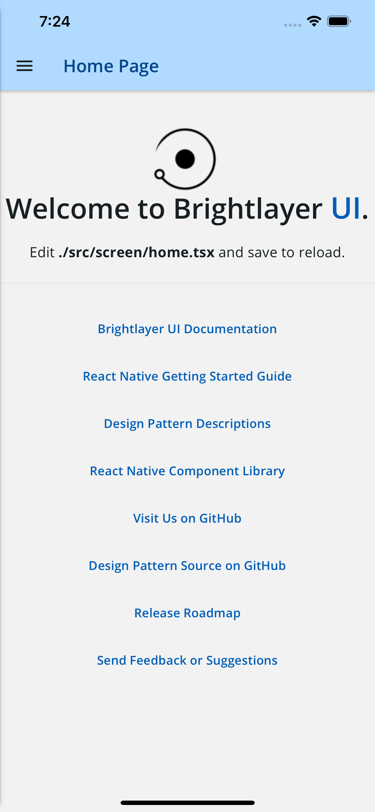
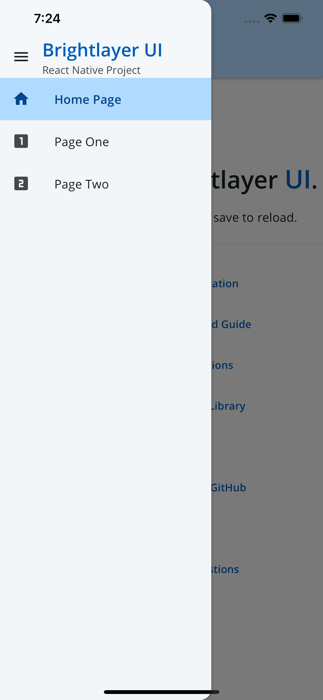

[](https://github.com/etn-ccis/blui-react-native-cli-templates/actions/workflows/blui-ci.yml)

# React Native CLI Templates

These are project templates that are used by the React Native CLI when starting a new Brightlayer UI project.

## Available Templates

### Blank

The [Blank template](https://www.npmjs.com/package/@brightlayer-ui/react-native-template-blank-typescript) provides a bare-bones application with Brightlayer UI components and themes automatically configured and ready to use.

### Routing

The [Routing template](https://www.npmjs.com/package/@brightlayer-ui/react-native-template-routing-typescript) provides all of the essential Brightlayer UI configuration as well as additional configuration for using [React Navigation](https://reactnavigation.org/). It also adds a navigation Drawer to switch between several sample screens.

### Authentication

The [Authentication template](https://www.npmjs.com/package/@brightlayer-ui/react-native-template-authentication-typescript) includes everything from the Routing template and also installs and configures the Brightlayer UI [react-native-auth-workflow](https://www.npmjs.com/package/@brightlayer-ui/react-native-auth-workflow) package to automatically wrap the main application with functions and screens for Login, Registration, Change Password, etc.

|                | placeholder landing page | navigation drawer & routing | login & registration screens |
| -------------- | ------------------------ | --------------------------- | ---------------------------- |
| Blank          | ✅                       |                             |                              |
| Routing        | ✅                       | ✅                          |                              |
| Authentication | ✅                       | ✅                          | ✅                           |

## Screenshots

##### Blank Template


##### Routing Template With Collapsed Drawer


##### Routing Template With Expanded Drawer


##### Authentication Template Login Page


## Usage

To create a new project using the Template simply run (recommended):

```sh
npx react-native init MyApp --template @brightlayer-ui/react-native-template-blank-typescript
npx react-native init MyApp --template @brightlayer-ui/react-native-template-routing-typescript
npx react-native init MyApp --template @brightlayer-ui/react-native-template-authentication-typescript
```
## Testing
to test a template go inside the template folder and run command
```sh
cd <template-name>/template
yarn install
cd ios && pod install
cd ..
yarn android/ios
```
Once you have tested make sure to delete Node modules, Pods and build folder for both android and ios

to check the template is working with react native cli 
```sh
npx react-native init myapp --template file:///the-path-to-location/blui-react-native-cli-templates/blank-typescript
```