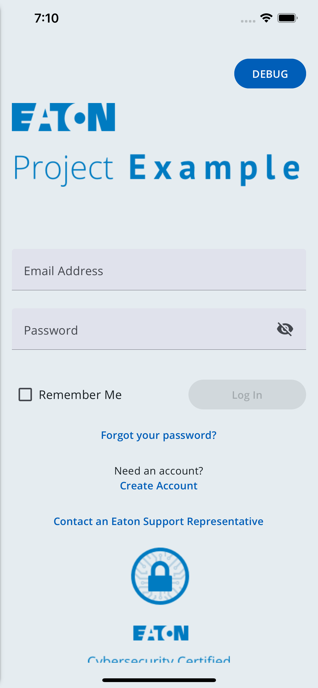

# React Native CLI Templates

These are project templates that are used by the Brightlayer UI CLI when starting a new Brightlayer UI project. They are used behind the scenes by the Brightlayer UI CLI.

## Available Templates

### Blank
The Blank template provides a bare-bones application with Brightlayer UI components and themes automatically configured and ready to use. This template is available in [TypeScript](https://www.npmjs.com/package/@brightlayer-ui/react-native-template-blank-typescript)(recommended) and [JavaScript](https://www.npmjs.com/package/@brightlayer-ui/react-native-template-blank).

### Routing
The Routing template provides all of the essential Brightlayer UI configuration as well as additional configuration for using [React Navigation](https://reactnavigation.org/). It also adds a navigation Drawer to switch between several sample screens. This template is available in [TypeScript](https://www.npmjs.com/package/@brightlayer-ui/react-native-template-routing-typescript)(recommended) and [JavaScript](https://www.npmjs.com/package/@brightlayer-ui/react-native-template-routing).

### Authentication
The Authentication template includes everything from the Routing template and also installs and configures the Brightlayer UI [react-native-auth-workflow](https://www.npmjs.com/package/@brightlayer-ui/react-native-auth-workflow) package to automatically wrap the main application with functions and screens for Login, Registration, Change Password, etc. This template is available in [TypeScript](https://www.npmjs.com/package/@brightlayer-ui/react-native-template-authentication-typescript)(recommended) and [JavaScript](https://www.npmjs.com/package/@brightlayer-ui/react-native-template-authentication).

|                | placeholder landing page | navigation drawer & routing  | login & registration screens  |
| -------------- | -- | -- | -- |
| Blank          | ✅ |    |    |
| Routing        | ✅ | ✅ |    |
| Authentication | ✅ | ✅ | ✅ |


## Screenshots
##### Blank Template

##### Routing Template With Collapsed Drawer

##### Routing Template With Expanded Drawer


##### Authentication Template Login Page


## Usage
You can use these templates with the Brightlayer UI CLI (recommended):

```sh
npx -p @brightlayer-ui/cli pxb new react-native --cli=rnc --template=blank
npx -p @brightlayer-ui/cli pxb new react-native --cli=rnc --template=routing
npx -p @brightlayer-ui/cli pxb new react-native --cli=rnc --template=authentication
```